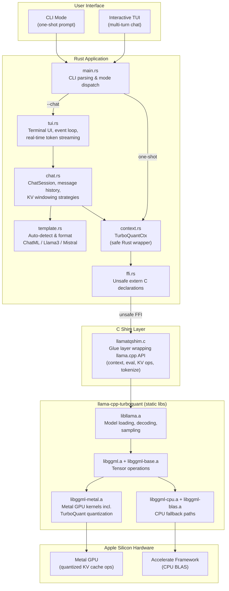
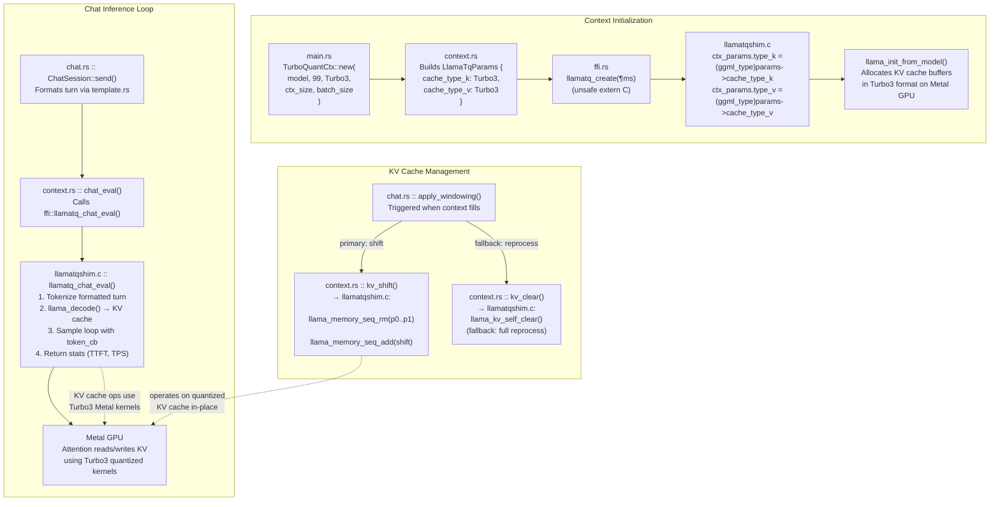

# turboquant-apple-silicon

**High-Performance Rust Integration for KV Cache Quantized LLM Inference on Apple Silicon**

[](https://www.gnu.org/licenses/gpl-3.0)
[-lightgrey.svg)](https://developer.apple.com/apple-silicon/)
[]()

`turboquant-apple-silicon` is a production-grade Rust integration that brings **aggressive KV cache quantization** to Apple Silicon GPUs (M1/M2/M3/M4/M5). By wrapping a specialized fork of `llama.cpp`, this project enables significantly reduced memory footprints for large models and long-context windows without sacrificing the power of Metal acceleration.

---

## 🚀 What makes this project unique?

This integration bridges the gap between low-level C++ performance and high-level Rust safety and ergonomics. It features:

*   **⚡ Metal-Optimized Kernels**: Direct GPU acceleration for quantized KV cache operations.
*   **📉 Massive Memory Savings**: Up to **6.4× compression** of the KV cache using `turbo2` and `turbo3` quantization levels.
*   **💬 Interactive TUI**: A sleek, terminal-based chat interface with "thinking mode" styling and trackpad support.
*   **🧠 Smart Context Management**: Sophisticated **KV Shift** strategy that preserves the system prompt while sliding the conversation window.
*   **🔍 Full Observability**: Real-time metrics for Time-to-First-Token (TTFT), Tokens Per Second (TPS), and memory allocation.

---

## 🔬 How It Works

### High-Level Architecture



### How TurboQuant Is Used

**TurboQuant** is a specialized fork of `llama.cpp` that adds custom Metal GPU compute kernels for **KV cache quantization**. In standard llama.cpp, the Key and Value caches used during attention are stored in FP16, consuming significant GPU memory. TurboQuant introduces two new quantization types — `Turbo2` and `Turbo3` — that compress these caches at the hardware level using optimized Metal shaders.

This project harnesses TurboQuant through a multi-layer integration:

1. **Build time** (`build.rs`): CMake compiles the TurboQuant fork with `GGML_METAL=ON` and `GGML_USE_TURBOQUANT=1`, producing static libraries including the quantized Metal kernels.
2. **FFI boundary** (`ffi.rs`): Defines `LlamaTqCacheType::Turbo3` (and `Turbo2`) as Rust enum variants that map directly to the fork's `ggml_type` enum values.
3. **Context creation** (`context.rs` → `llamatqshim.c`): When `TurboQuantCtx::new()` is called, it passes the cache type through FFI to the C shim, which sets `ctx_params.type_k` and `ctx_params.type_v` to the TurboQuant type. This single assignment is what activates the quantized Metal kernels for all subsequent KV cache operations.
4. **Runtime inference**: Every `llama_decode()` call during token generation now stores and retrieves KV entries using the quantized format on the GPU — no application-level code changes needed beyond the initial configuration.

The result: **up to 6.4x KV cache compression** with Metal-accelerated quantization/dequantization, enabling longer context windows and larger models within the same memory budget.

### TurboQuant Integration Close-Up



---

## 🏗️ Open Source Foundations

This project stands on the shoulders of giants:

1.  **[llama.cpp](https://github.com/ggerganov/llama.cpp)**: The industry-standard implementation for efficient LLM inference.
2.  **[TheTom/llama-cpp-turboquant](https://github.com/TheTom/llama-cpp-turboquant)**: A specialized fork providing the **TurboQuant** Metal compute kernels for KV cache quantization.
3.  **[tuinix](https://github.com/jpg/tuinix)**: The frame-based TUI engine used for the interactive chat interface.

---

## 🛠️ Installation & Setup

### Prerequisites

*   **macOS**: 13.0 (Ventura) or newer.
*   **Apple Silicon**: M-series chip (M1, M2, M3, M4, etc.).
*   **Tools**: Latest stable **Rust**, **CMake** (3.28+), and **Xcode Command Line Tools**.

### 1. Clone & Prepare the Submodule

The TurboQuant fork is required and should be cloned into the project root.

```bash
git clone https://github.com/jpg/turboquant-apple-silicon.git
cd turboquant-apple-silicon

# Clone the required llama-cpp-turboquant fork
git clone https://github.com/TheTom/llama-cpp-turboquant
cd llama-cpp-turboquant
git checkout 9c600bcd4   # Pinned stable commit for this integration
cd ..
```

### 2. Build the Project

The build system automatically handles the CMake configuration and **statically links** the `llama.cpp` internals to ensure a portable, single-binary output.

```bash
cargo build --release
```

### 3. Model Management

This project uses standard `.gguf` model files. You should place your models in the `models/` directory (created automatically or manually).

```bash
mkdir -p models
# Download your favorite model (e.g., Llama-3, Qwen, Mistral) into models/
```

---

## 📖 Usage Guide

The binary `turboquant-llama-rs` supports two primary modes: **One-shot CLI** and **Interactive TUI Chat**.

### A. CLI Mode (One-Shot Inference)
Best for scripts, automated tests, or single-prompt queries.

```bash
./target/release/turboquant-llama-rs models/llama-3-8b.gguf "Why is the sky blue?" \
  --temp 0.7 \
  --top-p 0.9 \
  --max-tokens 512
```

### B. Interactive TUI Mode (Multi-turn Chat)
Enter a high-performance terminal UI designed for multi-turn conversations.

```bash
./target/release/turboquant-llama-rs models/llama-3-8b.gguf --chat
```

**TUI Controls:**
*   **`Enter`**: Submit message.
*   **`Ctrl+C`**: Quit.
*   **`PgUp` / `PgDn`**: Scroll chat history.
*   **Trackpad**: Native two-finger scrolling supported.
*   **`/reset`**: Clear the current conversation context.

---

## ⚙️ Configuration Flags

| Flag | Default | Description |
|---|---|---|
| `<model_path>` | (Required) | Path to your GGUF model file. |
| `--chat` | `false` | Enable the interactive TUI mode. |
| `--ctx-size` | `8192` | Total context window size in tokens. |
| `--temp` | `0.0` | Sampling temperature (0.0 = greedy). |
| `--top-p` | `1.0` | Nucleus sampling (1.0 = disabled). |
| `--seed` | `0` | RNG seed for deterministic outputs. |
| `--max-tokens` | `4096` | Max tokens to generate per response. |
| `--verbose` | `false` | Print detailed memory diagnostics and timing data. |
| `--template` | (Auto) | Override chat template (`chatml`, `llama3`, `mistral`). |

---

## 🧩 Advanced Features

### Chat Template Auto-Detection
The engine automatically identifies the correct prompt format (ChatML, Llama-3, Mistral) by inspecting GGUF metadata. You rarely need to specify this manually unless using a non-standard fine-tune.

### KV Shift Windowing
To handle long conversations, TurboQuant implements a **KV Shift** strategy. Unlike simple circular buffers, it **pins the System Prompt** at the beginning of the context and only shifts the conversational "middle ground." This ensures the model never "forgets" its core instructions.

### Thinking Mode Styling
Models with internal reasoning (like DeepSeek or R1) often output `<think>...</think>` tags. The TUI automatically detects these and styles them in a **dimmed, italicized** font to visually separate reasoning from the final answer.

---

## ⚠️ Development Notes

*   **Static Linking**: The project forces static linkage of `ggml` and `llama` libraries to avoid `dyld` path issues common on macOS.
*   **Threading**: Metal contexts are **not thread-safe**. The Rust wrapper enforces `!Send` and `!Sync` to prevent safety violations across thread boundaries.
*   **Memory Reporting**: Run with `--verbose` to see exact buffer sizes allocated on the Metal GPU vs. System CPU.

---

## 📜 License

This project is licensed under the **GNU General Public License v3.0**. See the [LICENSE](LICENSE) file for details.
